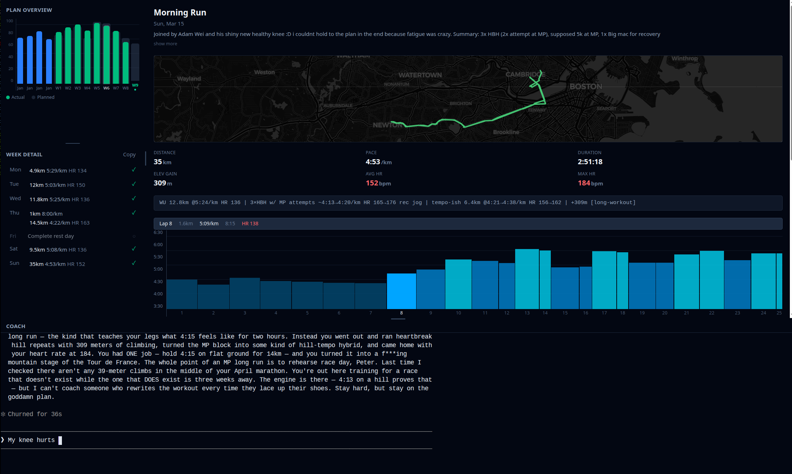

# MCPacer

An AI-powered running coach that connects Claude to your Strava data through the Model Context Protocol (MCP). Get personalized training plans, track your progress, and receive coaching feedback — all through a web dashboard with an integrated coaching terminal.

> ⚠️
> Use at your own risk. This is in beta, so if it messes up your computer or gets you injured it is not my fault. Suggestions are welcome. And, most importantly, have fun with it! 🤠 
> 
>Pete



## Features

- **Web Dashboard** — Plan overview, weekly breakdown, run detail with GPS maps and workout analysis charts
- **Integrated Coaching Terminal** — Chat with your AI coach directly in the dashboard
- **Customizable Personas** — Choose from multiple coaching styles (tough love, balanced, analytical, etc.)
- **Training Plans** — Create, track, and adjust structured plans in YAML format
- **Strava Sync** — Automatically pull activities, laps, HR, pace, and GPS data
- **Plan Adherence** — Visual comparison of planned vs actual weekly mileage
- **Persistent Memory** — Coach remembers your goals, injuries, patterns, and session history across conversations
- **Run Digestion** — Each run gets a compact single-line summary for efficient context loading

## Getting Started

### Prerequisites

- **Python 3.12+**
- **[UV](https://github.com/astral-sh/uv)** — Python package manager
- **[Node.js 18+](https://nodejs.org/)** — Required for the web frontend (includes npm)

### Install

```bash
git clone https://github.com/wernerpe/mcpacer.git
cd mcpacer
uv sync
claude mcp add strava -- uv run --directory $(pwd) mcpacer-server
cp -r skills/mcpacer ~/.claude/skills/mcpacer
```

This installs dependencies, registers the MCP server with Claude Code, and installs the `/mcpacer` coaching skill.

### Launch

```bash
uv run mcpacer
```

This starts both the FastAPI backend and SvelteKit frontend, then opens your browser. On first launch you'll see the onboarding screen.

### Onboarding

The onboarding screen walks you through connecting to Strava:

1. **Create a Strava API app** — Go to [developers.strava.com/docs/getting-started](https://developers.strava.com/docs/getting-started/) (Section B) and create an app with:
   - **Application Name:** `My Strava Running Coach`
   - **Website:** `http://localhost`
   - **Authorization Callback Domain:** `localhost`
2. **Enter your credentials** — Paste the Client ID and Client Secret into the onboarding form
3. **Authorize** — Click "Connect to Strava", approve in the popup, and you're in

Credentials and tokens are stored locally in `.env` and never leave your machine.

## How It Works

### Coaching Sessions

Run `/mcpacer` in the coaching terminal. The skill handles everything automatically:

1. Loads coach memory, run context, plan context, and session logs
2. Auto-loads your preferred persona
3. Digests any new runs
4. Opens the conversation

The coach reviews your training and responds based on your plan, recent activity, and history:

> How's that groin feeling? And are we sticking to the dress rehearsal plan tomorrow or are you going to "freestyle" it again?

### Dashboard Panels

| Panel | What it shows |
|-------|---------------|
| **Plan Overview** | Vertical bar chart of weekly mileage — planned (grey) vs actual (colored) |
| **Week Detail** | Day-by-day breakdown with prescribed and completed runs |
| **Run Detail** | GPS map, stats grid, workout analysis chart with proportional lap bars, splits table |
| **Coach** | Integrated terminal running Claude Code |

All panel dividers are draggable (VS Code-style).

### Training Plans

Plans are YAML files in `training_plans/`. The coach can create, modify, and track plans through MCP tools. Example structure:

```yaml
plan_name: Sub-3 Marathon Build
goal_race:
  date: 2026-04-04
  goal_time: "2:59:59"
weeks:
  - week_number: 1
    total_planned_distance_km: 75
    runs:
      - day_of_week: Wednesday
        type: workout
        distance_km: 16
        structure: "2.5km warmup, 5x2km @ 3:50-3:55, cooldown"
```

### Coaching Personas

Personas live in `coaching_data/personas/` as markdown files. Each defines a coaching style, tone, and behavioral rules. Available: `coach` (balanced), `david` (tough love), `roland`, `kim`, `hartmann`. Create your own by adding a `.md` file.

## Architecture

### MCP Tools

The coach interacts with your data through these MCP tools:

**Session Context**

| Tool | Description |
|------|-------------|
| `get_run_context` | Sync activities from Strava and return tiered training overview |
| `get_plan_context` | Active plan as compact text with current week highlighted |
| `get_coaching_personas` | List available persona names |
| `get_coaching_persona` | Load a persona's full coaching guidelines |

**Coach Memory**

| Tool | Description |
|------|-------------|
| `read_coach_memory` | Load COACH_MEMORY.md (athlete knowledge, flags, patterns) |
| `update_coach_memory` | Rewrite a specific section in-place |
| `get_session_logs` | Load recent session summaries (auto-distills older logs) |
| `save_session_log` | Write session summary at end of conversation |

**Activities & Runs**

| Tool | Description |
|------|-------------|
| `get_activities` | Get recent activities from Strava (paginated) |
| `get_activities_by_date_range` | Get activities within a date range |
| `get_activity_by_id` | Get a single activity by Strava ID |
| `get_activity_streams` | Get detailed data streams (pace, HR, altitude, cadence) |
| `get_run_detail` | Formatted run summary with laps, HR, pace, elevation |
| `get_pending_digests` | Get runs needing digestion with pre-built prompts |
| `save_run_digest` | Save a compact digest line for a run |
| `add_coaching_feedback` | Post coaching feedback to a Strava activity description |
| `add_run_note` | Add a coach note to a run (stored locally) |

**Training Plans**

| Tool | Description |
|------|-------------|
| `list_training_plans` | List all saved plans |
| `get_training_plan` | Retrieve full plan YAML by ID |
| `update_plan_run` | Modify a single workout |
| `update_plan_week` | Update week-level metadata |
| `add_plan_run` | Add a new workout to a week |
| `remove_plan_run` | Remove a workout from a week |
| `add_plan_comment` | Document changes with a comment |

### Memory & Context

Every session starts fresh — no conversation history carries over. All continuity comes from structured context loaded at session start:

```
SESSION CONTEXT (~4000 tokens)
├── Coach Memory .............. ~600 tok
│   Long-term athlete knowledge: goals, PRs, injuries, patterns
│   └── Session History (one-liners for older sessions)
├── Run Context ............... ~1400 tok
│   Tiered by age: one-liners for old weeks, full detail for recent
├── Plan Context .............. ~1100 tok
│   Day-by-day prescriptions, current week highlighted
├── Session Logs .............. ~200 tok
│   Last 3 session summaries for conversation continuity
└── Persona ................... ~500 tok
    Coaching tone, personality, communication style
```

### Project Structure

```
mcpacer/
├── src/mcpacer/
│   ├── server.py           # MCP server entry point
│   ├── strava_client.py    # Strava API client
│   ├── tools/              # MCP tool implementations
│   ├── storage/            # Run and plan persistence
│   ├── web/
│   │   ├── app.py          # FastAPI app (REST + WebSocket)
│   │   ├── api.py          # Dashboard REST endpoints
│   │   ├── auth.py         # Strava OAuth flow
│   │   ├── pty_manager.py  # Claude Code PTY management
│   │   └── launcher.py     # Starts backend + frontend
│   └── cli/                # CLI commands
├── web/                    # SvelteKit frontend
│   └── src/
│       ├── routes/         # Page routes
│       └── lib/            # Svelte components
├── coaching_data/          # Personas (tracked), memory (gitignored)
├── training_plans/         # Plan YAML files (gitignored)
├── run_data/               # Cached Strava data (gitignored)
└── skills/                 # Claude Code skills
```

### CLI Commands

```bash
uv run mcpacer                   # Launch the web dashboard
uv run mcpacer-update-data       # Sync run data from Strava
uv run mcpacer-analyze-plan      # Analyze plan adherence
uv run mcpacer-generate-calendar # Generate HTML training calendar
```

### Using as MCP Server Only

If you prefer to use the coaching tools without the web dashboard (e.g., in Claude Desktop):

```bash
claude mcp add strava -- uv run --directory /path/to/mcpacer mcpacer-server
cp -r /path/to/mcpacer/skills/mcpacer ~/.claude/skills/mcpacer
```

Then start a coaching session with `/mcpacer` in any Claude Code conversation.

## Acknowledgements

This project started as a fork of [strava-mcp-server](https://github.com/tomek-korbak/strava-mcp-server) by Tomek Korbak, extended with coaching features, training plan management, persistent memory, and a web dashboard.

## License

MIT License — see [LICENSE](LICENSE) for details.
